# Statistical Assessment of Layout Quality

## Introduction
In this document we'll be asking a few questions on how to test the quality of layout, i.e. aspect ratios, of rectangular treemap techniques.

The most common procedure on the literature involves choosing a few datasets, running test on the algorithm being proposed plus on a few other popular techniques, and plotting/ranking the mean and (sometimes) standard deviation of the produced layouts.

This methodology has a few flaws:

- Authors might "cherry pick" the results that go into the paper.
- Authors might choose to only test datasets whose nature favor their technique. 
- Authors might use a very small test cases.
- Authors might choose only to show statistics measurements (mean, median, max) that favor their results.
- And so on...

**The purpose of this document is to propose an *unbiased methodology* for quality of layout analysis.** 
And the base for this methodology will be statistics and probability.

## Background
First we need to understand the Central Limit Theorem and how the sampling distribution of a function can give us an estimate of the function value for the whole population.

Let's imagine that we want to find out the mean yearly income of the whole population of the world.

If it were possible, we could interview every person alive, ask them their income, and plot it like so:

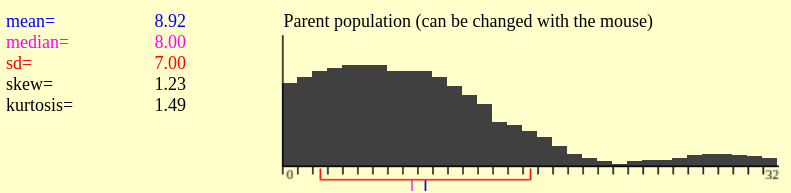

We then can compute the mean (which is what we were after) and other statistics if we want.

Since that is impossible, we'll have to try out best to **estimate** the mean of the population.

One way we can do it is by taking a random sample $x$ of size $N$ from the population and computing the mean of the sample $\overline{x}$.   

```{r, out.width = "350px", echo=F}
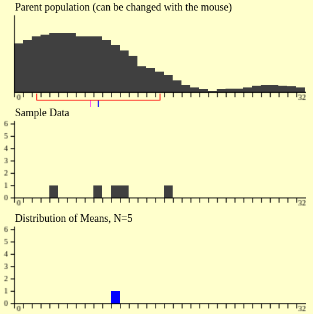
```

We can take another random sample from the population of same size $N$ and do the same again.

```{r, out.width = "350px", echo=F}
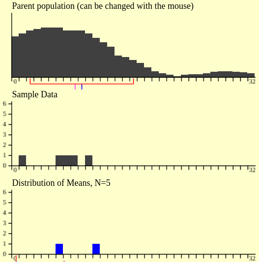
```

If we keep doing it, we will end up with a list of sample means. If we plot a histogram of these means, for a large number of samples, we'll end up with a distribution like this:

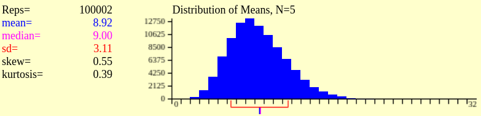


The *mean of the distribution of **means** * will be an approximation of the population mean. This is the Central Limit Theorem + The Law of Large Numbers at work.

Just to recap: 

> The Law of Large Numbers basically tells us that if we take a sample (n) observations of our random variable & avg the observation(mean)-- it will approach the expected value E(x) of the random variable.

> The Central Limit Theorem, tells us that if we take the mean of the samples (n) and plot the frequencies of their mean, we get a normal distribution! And as the sample size (n) increases --> approaches infinity, we find a normal distribution.

We can see that our normal curve has a large standard deviation. If the want to be more precise with our prediction, we can use a larger $N$.

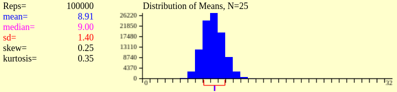

Using the area under a normal curve (Z table), we can make claims about our statistic within a confidence interval. 

```{r, out.width = "350px", echo=F}
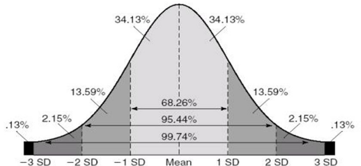
```

For example, since we can claim:

> There is a 68.26% chance that the mean income of the world population is in the range $\left[ 7.51, 10.41\right]$ (1 stardard deviation away from mean).

> There is a 95.44% chance that the mean income of the world population is in the range $\left[ 6.1, 11.71\right]$ (2 standard deviations away from mean).

I know that these intervals seem a bit loose, but increasing the sample size $N$ reduces the interval size.

I did this long introduction for a very specific reason: These statistical concepts work not only for distribution of means, we can use it with any other function we like (need a statistician to back me up here), for example, the standard deviation, variance, or even **average aspect ratio of treemaps**.

Imagine now the space of all possible weighted trees that can be inputted into a treemap algorithm.

I'm not even sure how to characterize this space, but imagine that we can run our treemap algorithm in every single tree that exists in this space. After that we can compute the mean aspect for all trees, AR variance, etc. This would be the most definite test of the quality of layout of an algorithm. We basically ran it through every possible input and computed an aggregation metric.

We know that we can't do that, as this space is infinite. But, if we can find a way to randomly sample this space, and for every sample compute the metrics we are interested in, just like we did with the world population, we will be able to *estimate* what the space mean (or other metric) would be!

## Methodology
Let's use this ellipse to represent the space (or population) of all possible trees.

```{r, out.width = "250px", echo=F}
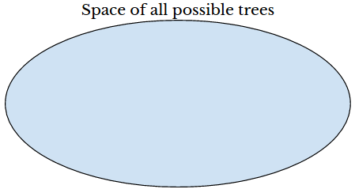
```

Then we randomly sample it with a sample size $N$ of $5$, for example, for each tree $t$ in the sample $x$ we compute it's corresponding treemap, and plot the distribution of aspect ratios and compute its mean.

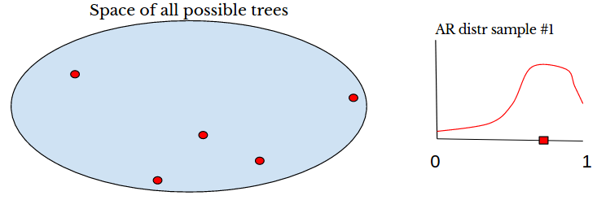{width=450px}

After that we take another random sample and do the same.

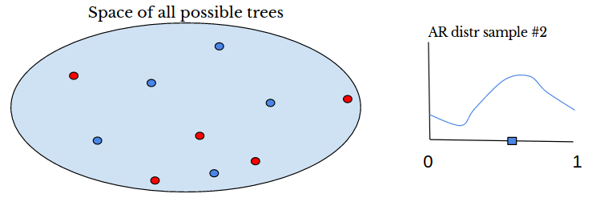{width=450px}

**After repeating the procedure a large number of times, we will end up with a *distribution of sample aspect ratio means*. And the mean of this distribution will be a fair estimator for the average aspect ratio that a technique will produce for any possible input tree.** 

If all this is correct, we just developed a methodology for testing treemap techniques that is independent of datasets, and all those ill intended actions that we mention in the introduction wouldn't affect the technique ranking/quality score.

Now there is one key element that we glossed over: How do we randomly sample the tree space? 
I have some ideas, but I need to think a little bit more about them.

References: 

https://www.khanacademy.org/math/statistics-probability/sampling-distributions-library/sample-means/v/central-limit-theorem

https://www.khanacademy.org/math/statistics-probability/sampling-distributions-library/sample-means/v/sampling-distribution-of-the-sample-mean

http://onlinestatbook.com/stat_sim/sampling_dist/index.html


# A New Metric For Quality Measurements

We just defined a new methodology for quality measurement, but it's a little bit over the top. It is a nice idea, but we still need to test how it behaves in practice.

Today I talked to a visiting professor about the problem and he proposed a very straight forward metric for measuring how good treemap layouts are.

What he proposed was the following: Imagine we have a 2d plane where the x axis is the longer side of a rectangle, and the y axis is the smaller size of a rectangle. Then we take a treemap and plot each cell as point. Intuitively we could say that the ideal case would be to have all points in the the line $x=y$. 

Let's see what a Squarified treemap of 2505 cells looks like: 

First let's read the rectangles.
```{r, message=F, warning=F}
library(dplyr)
library(magrittr)
library(ggplot2)
# Read rectangles from file
filename = "/home/eduardo/Desktop/treemap-analysis/rectangles/sqr/cpython/t320.rect"
cls = c("character","numeric", "numeric", "numeric", "numeric")
df = read.csv(filename, colClasses=cls, stringsAsFactors=FALSE, head=FALSE, sep=" ")
n_rectangles = nrow(df)
# Extract column of width and height
width  = df[, "V4"]
height = df[, "V5"]

df = df %>% 
  mutate(width = as.numeric(V4), height = as.numeric(V5)) %>%
  mutate(l = pmax(width, height)) %>%
  mutate(s = pmin(width, height))
```

And now plot the result.
```{r}
ggplot(df, aes(df$l, df$s)) +
  geom_abline(slope=1, intercept=0) + 
  geom_point(colour = "red", size = 0.3, alpha = 0.3) +
  xlab("longer(r)") + ylab("shorter(r)")
```

Then for each point, we compute the distace to the $x=y$ line. (and divide by the number of points)
```{r}
df = df %>%
  mutate(dist_point_line = abs(l + s) / sqrt(2))

sum(df[, "dist_point_line"]) / nrow(df)
```

Ok, we got a score of 26.3. Let's see how Slice and Dice performs for the same input tree. 


```{r}
filename = "/home/eduardo/Desktop/treemap-analysis/rectangles/snd/cpython/t320.rect"
cls = c("character","numeric", "numeric", "numeric", "numeric")
df = read.csv(filename, colClasses=cls, stringsAsFactors=FALSE, head=FALSE, sep=" ")
n_rectangles = nrow(df)
# Extract column of width and height
width  = df[, "V4"]
height = df[, "V5"]

df = df %>% 
  mutate(width = as.numeric(V4), height = as.numeric(V5)) %>%
  mutate(l = pmax(width, height)) %>%
  mutate(s = pmin(width, height))
```

```{r}
ggplot(df, aes(df$l, df$s)) +
  geom_abline(slope=1, intercept=0) +
  geom_point(colour = "red", size = 0.3, alpha = 0.3) 
```


```{r}
df = df %>%
  mutate(dist_point_line = abs(l + s) / sqrt(2))

sum(df[, "dist_point_line"]) / nrow(df)
```
Slice and Dice scored 148.83, a much higher result.

This idea borrows heavily on the concept of Errors and Residuals. I'll run some tests on all datasets for all technique and see the results. 

https://en.wikipedia.org/wiki/Errors_and_residuals

```{r setup, include=FALSE}
knitr::opts_chunk$set(cache=TRUE)
knitr::opts_chunk$set(eval = FALSE)
knitr::knit_exit()
```
# Definitions
First of all, we need to define what is Aspect Ratio (AR). According to wikipedia:

> The aspect ratio of an image describes the proportional relationship between its width and its height. It is commonly expressed as two numbers separated by a colon, as in 16:9.

For our purposes, we would like to define aspect ratios not as a relationship of width and height, but as a relationship of the longer and shorter side of a rectangle.

There are two natural ways of defining the aspect ratio of a rectangle R: $ARls(r) = longer(r)/shorter(r)$ or $ARsl(r) = shorter(r)/longer(r)$.

I'll call them $ARls$ for longer over shorter and $ARsl$ for shorter over longer. Let's see what is the advantage of one definition over the other (if there is one).

To do so, we'll pick the last layout generated by the Squarified techinque of the largest dataset we have available and plot the distribution of aspect ratios for both definitions.
```{r, message=F, warning=F}
library(dplyr)
library(magrittr)
# Read rectangles from file
filename = "/home/eduardo/Desktop/treemap-analysis/rectangles/sqr/cpython/t320.rect"
cls = c("character","numeric", "numeric", "numeric", "numeric")
df = read.csv(filename, colClasses=cls, stringsAsFactors=FALSE, head=FALSE, sep=" ")
n_rectangles = nrow(df)
sprintf("Number of rectangles: %i", n_rectangles)
# Extract column of width and height
width  = df[, "V4"]
height = df[, "V5"]

# ls is longer/shorter and sl is shorter/longer
ls = c()
sl = c()
for (i in 1:n_rectangles) {
  l = max(width[i], height[i])
  s = min(width[i], height[i])
  ls[i] = l / s
  sl[i] = s / l
}
```
Let's first take a look at $ARls$.
```{r}
summary(ls)
hist(ls, breaks=100)
boxplot(ls)
```
Looking at the boxplot and histogram we see a lot of outliers (items that are over 1.5*IQR over the upper quartile). 
These are pretty harmful if we want to do any sort of prediction in the data.
Let's look at the $ARsl$ distribution.

```{r}
summary(sl)
hist(sl)
```


# --------------


First, set the working directory to be where this file is. In the IDE go to Session -> Set Working Directory -> To Source file Location.
Outside the IDE, do something like this `setwd("~/Desktop/lps/aspect-ratios")`.

List files containing the rectangles. 
Each files is a 'space' separated file containing *id x y width height* of every rectangle generated by the technique.
Merge all files in a single huge dataframe. (it takes a few seconds)
```{r, message=F, warning=F}
library(dplyr)
library(magrittr)

rectangle_files = list.files("./rectangles/sqr/", pattern=".*.rect", recursive=TRUE, full.names=TRUE)
# There is too much data, let's sample
set.seed(42)
sample_size = 300
rectangle_files_sample = sample(rectangle_files, sample_size, replace=FALSE)

# It was dumb not using comma separated values. Fix it tomorrow. For now ignore dataframes with more than 5 columns.
dataframes = lapply(rectangle_files_sample, function(filename){
    df = read.csv(filename, head = FALSE, sep = " ")
    if (ncol(df) == 5) {
      return(df)
    }
})

# Remove NULL items -- elements with ncol != 5
dataframes = dataframes[!sapply(dataframes, is.null)]
# Merge
df = do.call(rbind, dataframes)
```

The only info we are actually interested in are the width and height of each rectangle.
More specifically, we are interested in the longest and shortest side of each rectangle
```{r}
df = mutate(df, width = as.numeric(V4), height = as.numeric(V5))

df = mutate(df, longest = pmax(width, height) , shortest = pmin(width, height)) %>%
  select(longest, shortest) %>%
  filter(!is.na(longest)) %>% # Not sure why, but some rows had NAs. Maybe the remove null is not effective 
  filter(!is.na(shortest))

head(df)
dim(df)
```

Now let's see the difference between the max/min vs the min/max ratios.
The standard in treemap papers is to use the former, but I think we'll see a behaviour close to the "break the stick" problem.
The second, which ranges between ]0,1] might have a better behaved distribution.
```{r}
library(ggplot2)
df %>%
  ggplot(aes(longest/shortest)) +
    geom_histogram()
```

```{r}
df %>%
  ggplot(aes(shortest/longest)) +
    geom_histogram()
```

Min/max procuces a much nicer looking and better behaved distribution. Let's use it for now on. 
```{r}
library(moments)

max_over_min = df$longest/df$shortest
summary(max_over_min)
sprintf("Standard deviation: %f", sd(max_over_min))
sprintf("Kurtosis: %f", kurtosis(max_over_min))
sprintf("Skewness: %f", skewness(max_over_min))

min_over_max = df$shortest/df$longest
summary(min_over_max)
sprintf("Standard deviation: %f", sd(min_over_max))
sprintf("Kurtosis: %f", kurtosis(min_over_max))
sprintf("Skewness: %f", skewness(min_over_max))
```


The skewness of a distribution is actually a really good metric to compare different techniques.
In the case of shortest/longest side, the more negative the skewness, the best overall aspect ratios the techniques generates, i.e., there are more items closer to 1.

### Not true.

Now that we have a feeling for the distribution, let's move to the interesting part.

# Inference
If we consider our datasets a truly random sample of the space of possible trees, we can make statistical claims about the whole population. 
That is, we can infer, within a confidence interval (let's say 99%), that any rectangle produced by a certain techniques, will have a given mean and standard deviation.
Bringing it closer to our problem, we could claim something like: 

_There is a 99% chance that any rectagle produced by SQR will have aspect ratio in the range (0.67, 0.73). _

 or

_With a 99% confidence interval, any rectagle produced by SQR will have aspect ratio will have a mean of 0.7 with std of 0.3. _

This decouples the results from the datasets. Our claims become geared towards the techniques themselves.
Given that we could produce a result like this:

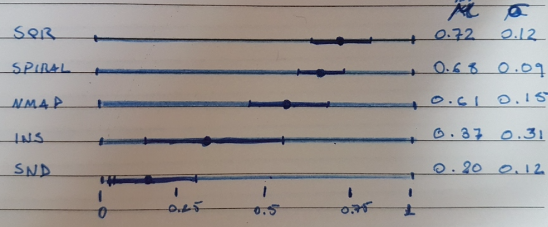

Which in my opinion would be a really elegant way of comparing the visual quality of treemap techniques.

Ok, how do we go about doing it? Here are some references that I used:

https://www.khanacademy.org/math/statistics-probability/confidence-intervals-one-sample/estimating-population-proportion/v/confidence-interval-example

https://www.khanacademy.org/math/statistics-probability/confidence-intervals-one-sample/estimating-population-mean/v/confidence-interval-1

https://www.stat.wisc.edu/~yandell/st571/R/append5.pdf

There are two ways of estimating the population mean and standard deviation. 

# Estimator
The first is pretty straight forward and uses only the mean, standard deviation and size of our sample.
We estimate that the mean of the population (all possible rectangles generated by SQR) is the same as the mean of our sample.
And since the population standard deviation is seldom known, the standard error of the mean is usually estimated as the sample standard deviation divided by the square root of the sample size (assuming statistical independence of the values in the sample).

https://en.wikipedia.org/wiki/Sampling_distribution

https://en.wikipedia.org/wiki/Standard_error

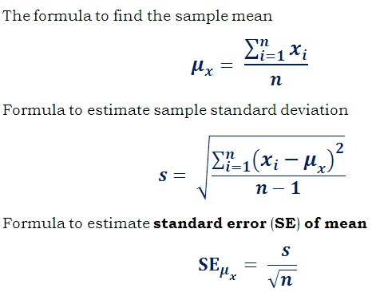


```{r}
sample_estimate_population_mean = mean(min_over_max)
sample_estimate_population_se  = sd(min_over_max) / sqrt(length(min_over_max))
sprintf("Mean: %f   Standard Error: %f", sample_estimate_population_mean, sample_estimate_population_se)
```

# Central Limit Theorem + Simulation
The second way relies on the Central Limit Theorem. The idea is to generate a sampling distribution of sample means and compute it's mean and standard deviation.
Ideally, our sample size should be large, because as seen below, the largest the sample size, the smaller the standard deviation.

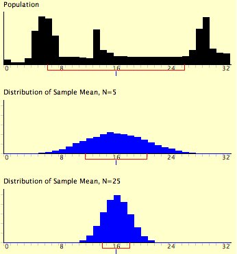

For a great explanation on sampling distribution of the sample mean see: https://www.khanacademy.org/math/statistics-probability/sampling-distributions-library/sample-means/v/sampling-distribution-of-the-sample-mean


```{r}
n_samples = 5000
sample_size = 100000
sample_dist = vector(mode="numeric", length=n_samples)
for (i in 1:n_samples) {
  draws = sample(min_over_max, size=sample_size, replace=TRUE)
  sample_dist[i] = mean(draws)
}

simulated_estimate_population_mean = mean(sample_dist)
simulated_estimate_population_sd = sd(sample_dist)
sprintf("Mean: %f   Std: %f", simulated_estimate_population_mean, simulated_estimate_population_sd)
```

We can plot the two results to see if they match:
```{r}
ggplot() + 
  aes(sample_dist) +
  geom_histogram() + 
  stat_function(fun=dnorm, args=list(mean=sample_estimate_population_mean, sd=sample_estimate_population_se))
```

Using a Z table, we know that if we want a confidence level of 99%, we need to consider the interval within 2.58 standard deviations of the mean.

```{r}
sprintf("99 per cent confidence inteval: %f +- %f", simulated_estimate_population_mean, 2.58 * simulated_estimate_population_sd)
sprintf("99 per cent confidence inteval: %f +- %f", sample_estimate_population_mean, 2.58 * sample_estimate_population_se)
```

# Computing estimate mean for all techniques with 99% confidence
```{r, eval=F}
extract_ar = function(technique_dir, n_files, n_samples) {

  # Sample n_files from the rectangle files generated by a technique.
  # This is done because it is too expensive to open all files in R and merge them in a single dataframe. Each technique has ~150Mb in outputted rectangles.
  rectangle_files = list.files(technique_dir, pattern=".*.rect", recursive=TRUE, full.names=TRUE)

  rectangle_files_sample = sample(rectangle_files, n_files, replace=FALSE)
  # It was dumb not using comma separated values. Fix it tomorrow. For now ignore dataframes with more than 5 columns.
  dataframes = lapply(rectangle_files_sample, function(filename){
      df = read.csv(filename, head = FALSE, sep = " ")
      if (ncol(df) == 5) {
        return(df)
      }
  })

  # Remove NULL items -- elements with ncol != 5
  dataframes = dataframes[!sapply(dataframes, is.null)]
  # Merge
  df = do.call(rbind, dataframes)
  
  #
  df = df %>% 
    mutate(width = as.numeric(V4), height = as.numeric(V5)) %>%
    mutate(ar = pmin(width, height) / pmax(width, height)) %>%
    filter(!is.na(ar)) %>% # Not sure why, but some rows had NAs. Maybe the remove null is not effective 
    sample_n(n_samples)

  # Return vector with n_samples aspect ratio values 
  return(df[, "ar"])
}
```

```{r, message=F, warning=F, eval=F}

# First collect the technique names/directories
technique_directories = list.files("./rectangles", recursive=FALSE, full.names=TRUE)

results = data.frame(technique=character(),
                     mean=numeric(), 
                     se=numeric(),
                     skewness=numeric(),
                     stringsAsFactors=FALSE)

n_files = 500
n_samples = 100000
# For each technique
for (technique_dir in technique_directories) {
  # Get the aspect ratios of n_sample randomly picked rectangles
  aspect_ratio_sample = extract_ar(technique_dir, n_files, n_samples)

  technique_id = sub(".*[/]", "", as.character(technique_dir))
  estimate_population_mean = mean(aspect_ratio_sample)
  estimate_population_se = sd(aspect_ratio_sample) / sqrt(n_samples)
  skew = skewness(aspect_ratio_sample)
  
  results[nrow(results) + 1,] = list(technique_id, estimate_population_mean, estimate_population_se, aspect_ratio_sample, skew)
}


```


```{r, eval=F}
sapply(results, class)

results$technique = factor(results$technique, levels=results[order(results$mean), "technique"])


p <- ggplot(results, aes(technique, mean))  
p <- p + geom_point(stat="identity", position='dodge')
p + geom_errorbar(aes(ymin = mean - 2.58 * se, ymax = mean + 2.58 *se), width = 0.2)
```


