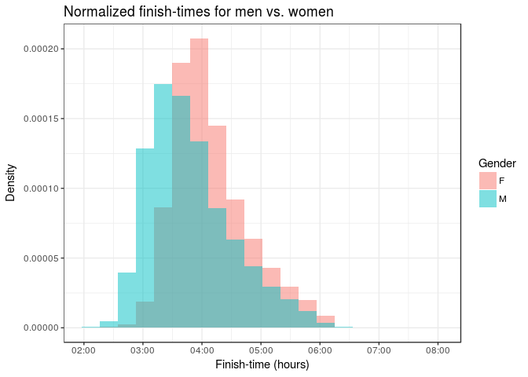

2017 Boston Marathon Analysis
================
Eduardo Faccin Vernier
December 2017

Introduction
------------

Legend says that after the military victory against the Persians at the Battle of Marathon (490 BC), Greek soldier Pheidippides ran the 42.195 kilometres that separate Marathon and Athens to report the victory. What people seem to forget about this fable is that Pheidippides died *immediately* after delivering the message. And so long-distance running as we know was born...

This work analyses the 2017 Boston Marathon that took place on April 17th. Using data collected from 26,400 athletes, we will try to identify relationships between gender, age, ability, finishing times and consistency. We are going to use visualizations and statistics to support our claims.


Dataset
-------

The dataset used for this study is available at <https://www.kaggle.com/rojour/boston-results> .

It consists of 26400 observations (athletes), each of which containing name, age, gender, country, city and state (where available), times at 9 different stages of the race, finish time and pace, overall place, gender place and division place. Some observations have missing time data, we will filter those out for simplicity.

Given the focus of our analysis, we'll keep only information about the times, sex and gender of each athlete. The dataset is ordered by finishing time. Below we can have a glimpse of the data of the first few runners to cross the line.

``` r
# Import libraries
library(dplyr);
library(magrittr);
library(ggplot2);
library(lubridate);
library(readr);
```

``` r
df <- read.csv("./marathon_results_2017.csv", header=TRUE, stringsAsFactors=FALSE)
# Select only column
df <- df[c('Age', 'M.F', 'X5K', 'X10K', 'X15K', 'X20K', 'X25K', 'X30K', 'X35K', 'X40K', 'Official.Time')]

# Filter runners that had technical problems with recording apparatus
df %<>% filter(X5K != '-' & X10K != '-' & X15K != '-' & X20K != '-' & X25K != '-' & X30K != '-' & X35K != '-' & X40K != '-')
colnames(df)[colnames(df) == 'M.F'] <- 'Gender'

head(df)
```

    ##   Age Gender     X5K    X10K    X15K    X20K    X25K    X30K    X35K
    ## 1  24      M 0:15:25 0:30:28 0:45:44 1:01:15 1:16:59 1:33:01 1:48:19
    ## 2  30      M 0:15:24 0:30:27 0:45:44 1:01:15 1:16:59 1:33:01 1:48:19
    ## 3  25      M 0:15:25 0:30:29 0:45:44 1:01:16 1:17:00 1:33:01 1:48:31
    ## 4  32      M 0:15:25 0:30:29 0:45:44 1:01:19 1:17:00 1:33:01 1:48:58
    ## 5  31      M 0:15:25 0:30:28 0:45:44 1:01:15 1:16:59 1:33:01 1:48:41
    ## 6  40      M 0:15:25 0:30:28 0:45:44 1:01:15 1:16:59 1:33:01 1:48:52
    ##      X40K Official.Time
    ## 1 2:02:53       2:09:37
    ## 2 2:03:14       2:09:58
    ## 3 2:03:38       2:10:28
    ## 4 2:04:35       2:12:08
    ## 5 2:05:00       2:12:35
    ## 6 2:05:21       2:12:45

``` r
print(paste("Number of runners: ", nrow(df)))
```

    ## [1] "Number of runners:  26262"

``` r
print(paste("Number faulty observations: ", 26400 - nrow(df)))
```

    ## [1] "Number faulty observations:  138"

As we can see, there are 8 columns that show the surpassed time at each 5K mark. Later we'll do some pace variance analysis, so we'll convert these times to be the time passed **not** from the start of the race, but from the mark of the previous 5K split.

This means that, for example, the X15K column will not tell how long it took the runner to run 15 kilometers, but how long it took the runner to run the last 5 kilometers preceding the 15K mark, i.e., from 10K to 15K.

``` r
cols <- c('X5K', 'X10K', 'X15K', 'X20K', 'X25K', 'X30K', 'X35K', 'X40K')
df %<>% mutate_each_(funs(as.POSIXct(., format="%H:%M:%S")), cols);

df$X40K <- as.numeric(difftime(df$X40K, df$X35K, units='secs'))
df$X35K <- as.numeric(difftime(df$X35K, df$X30K, units='secs'))
df$X30K <- as.numeric(difftime(df$X30K, df$X25K, units='secs'))
df$X25K <- as.numeric(difftime(df$X25K, df$X20K, units='secs'))
df$X20K <- as.numeric(difftime(df$X20K, df$X15K, units='secs'))
df$X15K <- as.numeric(difftime(df$X15K, df$X10K, units='secs'))
df$X10K <- as.numeric(difftime(df$X10K, df$X5K, units='secs'))
df$X5K <- as.numeric(difftime(df$X5K, as.POSIXct('00:00:00', format="%H:%M:%S"), units='secs'))
head(df)
```

Now we can read the data frame above as: it took 925 seconds for runner \#1 to run the first 5K of the race, 903s to run the next 5K, and so on.

But before we move to the analysis of the results, let's take a look at the demographics of the population.

Inside a marathon there are many simultaneous events. There are men and women's division, as well as 10 official divisons by age intervals. The main age group is the \[18, 39\] year old, after that there are 9 age groups each with 5 a year spa,, but for sake of conciseness, we'll divide athletes into 2 groups: young (belonging to the \[18, 39\] age bracket), and 40+, for the remaining.

``` r
demo <- df %>%
  mutate(Gender, Gender = ifelse('M' == Gender,'MEN', 'WOMEN')) %>% 
  mutate(Age, Age = ifelse(Age >= 40, '40+', 'YOUNG')) %>% 
  group_by(Gender, Age) %>% 
  count()

demo$comb <- paste(demo$Age, demo$Gender)

# Pie Chart with Percentages
slices <- demo$n
lbls <- demo$comb
pct <- round(slices/sum(slices)*100)
lbls <- paste(lbls, pct) # add percents to labels 
lbls <- paste(lbls,"%",sep="") # ad % to labels 
pie(slices, labels = lbls, col=c("#0061ff", "#76c3f7", "#f372ff", "#fcc7f8"), main="Distribution of gender and age")
```


Given the pie chart above, we can see that our population composed of 55% men and 45% women.

As for age, 44% of people are in the "young" range, whilst the remaining are 40 years or older.

The largest group is 40+ men and the smallest is young men, which is interesting.

How gender and age influence finish-times
-----------------------------------------

The graph below shows compares finishing times between men and women. Because the number of male and female runners differ, the histograms have been normalized.

The plot tells us that men tend to be faster than women. This is not unexpected, as there are physiological reasons why men are capable of faster finish-times than women.

``` r
df$Official.Time <- as.POSIXct(df$Official.Time, format="%H:%M:%S")
ggplot(df, aes(df$Official.Time, fill = df$Gender)) +
  geom_histogram(bins = 20, aes(y=..density..), alpha=0.5, position="identity", lwd=0.2) +
  labs(title = "Normalized finish-times for men vs. women", x = "Finish-time (hours)", y = "Density") +
  scale_fill_discrete(name="Gender") + 
  theme_bw()
```



The next graph shows finishing times for the two age groups we defined.

We can see that among fast finishing times (let's say below 4 hours), the number of young runners is proportionally higher than that of older runners.

But that doesn't seem to be the case for the slower runners, as we can see that after the 5:00 hour mark, the area under the histogram seems to be equivalent for both age groups.

In other words: yes, the fastest young runners are faster than the fastest old runners, but that is not true for the slower athletes. That is, age doesn't seem to be of much importance for the least skilled runners.

``` r
df %>%
  mutate(Age, Age = ifelse(Age > 40, '40+', 'YOUNG')) %>% 
  ggplot(aes(Official.Time, fill = Age)) +
    geom_histogram(bins = 20, aes(y=..density..), alpha=0.5, position="identity", lwd=0.2) +
    labs(title = "Normalized finish-times by age group", x = "Finish-time (hours)", y = "Density") +
    scale_fill_discrete(name="Age group") + 
    theme_bw()
```


How finish-time, gender and age influence pace consistency
----------------------------------------------------------

Finish-time is one metric for running performance, but it is not the only one. Pace variation is often seen as an indicator of ability and, generally speaking, less variation in pace is considered to be a sign of a more disciplined and able runner.

We would to see if these two measurements are correlated. That is, are fast runners really more disciplined?

To find out we compute the standard deviation between the 8 5K splits for each runner, and then group them into 20 evenly spaced time-intervals. The first runners to finish the race are in group 1 and last are in group 20 (note that the grouping is not done by finishing position, but finishing-time).

Then for each group we compute the mean standard deviation. The plot below show how finish group relates to pace variation.

``` r
n_groups <- 20
df$Official.Time <- as.numeric(difftime(df$Official.Time, as.POSIXct('00:00:00', format="%H:%M:%S"), units='mins'))
df <- df[df$Official.Time < quantile(df$Official.Time, 0.99), ]
df$group <- cut(df$Official.Time, n_groups)

women <- df %>% filter(Gender == 'F')
men <- df %>% filter(Gender == 'M')

b_splits = split(df, df$group)  # Time splits
w_splits = split(women, women$group)  
m_splits = split(men, men$group)  

g_sd_df <- data.frame("group" = numeric(0),
                      "Gender" = character(0),
                      "n" = numeric(0),
                      "mean_sd" = numeric(0),
                      "sd_sd" = numeric(0),
                      stringsAsFactors = FALSE)

for (i in 1:n_groups) {
  gender <- 'MALE'
  mean_sd <- as.numeric(m_splits[[i]] %>%
                    select(cols) %>%
                    transform(SD=apply(., 1, sd, na.rm = TRUE)) %>%
                    summarize(sample_sd = mean(SD, na.rm = TRUE)))
  sd_sd <- as.numeric(m_splits[[i]] %>%
                    select(cols) %>%
                    transform(SD=apply(., 1, sd, na.rm = TRUE)) %>%
                    summarize(sd_sd = sd(SD, na.rm = TRUE)))
  n <- as.numeric(m_splits[[i]] %>%
                    select(Official.Time) %>%
                    summarize(n = n()))
  g_sd_df[nrow(g_sd_df) + 1,] = c(i, gender, n, mean_sd, sd_sd)
  
  gender <- 'FEMALE'
  mean_sd <- as.numeric(w_splits[[i]] %>%
                    select(cols) %>%
                    transform(SD=apply(., 1, sd, na.rm = TRUE)) %>%
                    summarize(sample_sd = mean(SD, na.rm = TRUE)))
  sd_sd <- as.numeric(w_splits[[i]] %>%
                    select(cols) %>%
                    transform(SD=apply(., 1, sd, na.rm = TRUE)) %>%
                    summarize(sd_sd = sd(SD, na.rm = TRUE)))
  n <- as.numeric(w_splits[[i]] %>%
                    select(Official.Time) %>%
                    summarize(n = n()))
  if (n != 0) {
    g_sd_df[nrow(g_sd_df) + 1,] = c(i, gender, n, mean_sd, sd_sd)
  }

  gender <- 'BOTH'
  mean_sd <- as.numeric(b_splits[[i]] %>%
                    select(cols) %>%
                    transform(SD=apply(., 1, sd, na.rm = TRUE)) %>%
                    summarize(sample_sd = mean(SD, na.rm = TRUE)))
  sd_sd <- as.numeric(b_splits[[i]] %>%
                    select(cols) %>%
                    transform(SD=apply(., 1, sd, na.rm = TRUE)) %>%
                    summarize(sd_sd = sd(SD, na.rm = TRUE)))
  n <- as.numeric(b_splits[[i]] %>%
                    select(Official.Time) %>%
                    summarize(n = n()))
  g_sd_df[nrow(g_sd_df) + 1,] = c(i, gender, n, mean_sd, sd_sd)
  
}

g_sd_df$n <- as.numeric(g_sd_df$n)
g_sd_df$mean_sd <- as.numeric(g_sd_df$mean_sd)
g_sd_df$sd_sd <- as.numeric(g_sd_df$sd_sd)
g_sd_df$group <- as.numeric(g_sd_df$group)
```

``` r
intervals = unique(df$group)
for (i in 1:length(intervals)) print(paste("Group ", i,  ' - Finished race in the', intervals[i], 'minutes interval.'))
```

    ## [1] "Group  1  - Finished race in the (129,141] minutes interval."
    ## [1] "Group  2  - Finished race in the (141,152] minutes interval."
    ## [1] "Group  3  - Finished race in the (152,163] minutes interval."
    ## [1] "Group  4  - Finished race in the (163,174] minutes interval."
    ## [1] "Group  5  - Finished race in the (174,186] minutes interval."
    ## [1] "Group  6  - Finished race in the (186,197] minutes interval."
    ## [1] "Group  7  - Finished race in the (197,208] minutes interval."
    ## [1] "Group  8  - Finished race in the (208,219] minutes interval."
    ## [1] "Group  9  - Finished race in the (219,230] minutes interval."
    ## [1] "Group  10  - Finished race in the (230,242] minutes interval."
    ## [1] "Group  11  - Finished race in the (242,253] minutes interval."
    ## [1] "Group  12  - Finished race in the (253,264] minutes interval."
    ## [1] "Group  13  - Finished race in the (264,275] minutes interval."
    ## [1] "Group  14  - Finished race in the (275,286] minutes interval."
    ## [1] "Group  15  - Finished race in the (286,298] minutes interval."
    ## [1] "Group  16  - Finished race in the (298,309] minutes interval."
    ## [1] "Group  17  - Finished race in the (309,320] minutes interval."
    ## [1] "Group  18  - Finished race in the (320,331] minutes interval."
    ## [1] "Group  19  - Finished race in the (331,342] minutes interval."
    ## [1] "Group  20  - Finished race in the (342,354] minutes interval."

Based on the plot below we can make two claims: 1 - Fast runners' paces vary less than slow runners. 2 - Men tend to be less disciplined than women.

``` r
ggplot(g_sd_df) +
  geom_point(aes(x=group, y=mean_sd, colour=Gender)) +
  scale_color_manual(values=c('black', 'violet', 'blue')) +
  theme_bw() +
  labs(title = "Relationship between finish-time and pace variation", x = "Time group index", y = "Mean standard deviation")
```


The graph above is very enlightening but it doesn't take into consideration that some groups have have few runners, introducing a level of uncertainty to the statistics.

Fortunately, there are ways we can account for that. If want to find out the population standard deviation and we are given a sample standard deviation and sample size, and we assume that our population data is normally distributed, we can use a chi-square distribution to generate a confidence interval.

For more info see: <http://www.milefoot.com/math/stat/ci-variances.htm> <https://www.youtube.com/watch?v=d7nLL6cUC0I>

``` r
g_sd_df <- filter(g_sd_df, g_sd_df$Gender == 'MALE' | g_sd_df$Gender == 'FEMALE')
g_sd_df$min_error <- ((g_sd_df$n-1) * (g_sd_df$mean_sd * g_sd_df$mean_sd)) / qchisq(.025, df = g_sd_df$n - 1, lower.tail = FALSE)
g_sd_df$max_error <- ((g_sd_df$n-1) * (g_sd_df$mean_sd * g_sd_df$mean_sd)) / qchisq(.975, df = g_sd_df$n - 1, lower.tail = FALSE)
g_sd_df
```

    ##    group Gender    n   mean_sd     sd_sd   min_error  max_error
    ## 1      1   MALE   20  38.27507  19.92175    847.2654   3125.199
    ## 2      2   MALE   43  39.46135  29.95823   1058.6881   2515.603
    ## 3      2 FEMALE    8  36.43171  18.58525    580.2174   5497.991
    ## 4      3   MALE  174  47.93407  33.78129   1881.0831   2870.597
    ## 5      3 FEMALE   16  36.29235  24.29730    718.7404   3154.996
    ## 6      4   MALE  572  55.72010  42.95869   2773.8690   3498.855
    ## 7      4 FEMALE   24  36.52757  19.61190    805.9763   2625.480
    ## 8      5   MALE 1138  59.84978  44.26759   3304.8660   3895.691
    ## 9      5 FEMALE  105  42.63999  26.56413   1409.9462   2434.456
    ## 10     6   MALE 1545  88.98942  55.16976   7388.8936   8508.828
    ## 11     6 FEMALE  337  55.49481  31.18230   2662.3021   3604.066
    ## 12     7   MALE 1742 114.85999  70.37731  12358.4826  14115.027
    ## 13     7 FEMALE  753  62.15704  41.01972   3500.9013   4285.801
    ## 14     8   MALE 1654 140.95475  84.06847  18580.3653  21295.513
    ## 15     8 FEMALE 1348  73.73308  41.29138   5048.2582   5871.701
    ## 16     9   MALE 1574 169.92828  99.16815  26959.2569  31004.896
    ## 17     9 FEMALE 1717 100.93465  54.53018   9539.0619  10905.395
    ## 18    10   MALE 1363 185.47146 108.04135  31955.4829  37136.857
    ## 19    10 FEMALE 1750 121.90053  66.16859  13922.0327  15895.969
    ## 20    11   MALE  925 212.57744 122.19973  41335.9049  49610.377
    ## 21    11 FEMALE 1325 146.91404  77.19533  20029.5126  23327.098
    ## 22    12   MALE  813 234.36426 134.95519  49952.2214  60686.876
    ## 23    12 FEMALE 1097 171.19461  86.19351  27000.6523  31924.927
    ## 24    13   MALE  673 262.51198 150.15485  62099.3021  76918.063
    ## 25    13 FEMALE  802 190.69926 113.34592  33051.7745  40208.139
    ## 26    14   MALE  519 280.14990 181.11344  69738.6719  88993.078
    ## 27    14 FEMALE  643 210.07861 129.45303  39676.7446  49388.706
    ## 28    15   MALE  415 309.99857 189.94179  84242.5460 110661.660
    ## 29    15 FEMALE  516 222.02667 125.29180  43788.3176  55917.706
    ## 30    16   MALE  325 314.38013 186.03662  85220.8354 116011.807
    ## 31    16 FEMALE  397 238.85977 178.66379  49871.9874  65916.083
    ## 32    17   MALE  267 327.03602 165.03295  90872.1768 127738.242
    ## 33    17 FEMALE  311 253.37339 139.24620  55179.2021  75636.709
    ## 34    18   MALE  223 365.73323 209.58219 111988.8121 162598.919
    ## 35    18 FEMALE  246 286.32150 165.47138  69199.8309  98679.582
    ## 36    19   MALE  141 403.64226 321.92175 130604.4890 209001.699
    ## 37    19 FEMALE  205 300.87035 199.73412  75236.5537 111019.293
    ## 38    20   MALE  112 382.90041 181.30418 114566.4766 194351.314
    ## 39    20 FEMALE  161 306.52079 217.83997  76341.5100 118489.741

``` r
ggplot(g_sd_df, aes(x=group, y=mean_sd, colour=Gender)) +
  geom_errorbar(aes(ymin=min_error, ymax=max_error)) +
  scale_color_manual(values=c('violet', 'blue')) +
  theme_bw()
```


``` r
a_splits = split(df, df$Age)  # Time splits

a_sd_df <- data.frame("age" = character(0),
                      "n" = numeric(0),
                      "mean_sd" = numeric(0),
                      "sd_sd" = numeric(0),
                      stringsAsFactors = FALSE)

for (i in 1:length(a_splits)) {
   age <- a_splits[[i]]$Age[1]
   mean_sd <- as.numeric(a_splits[[i]] %>%
                    select(cols) %>%
                    transform(SD=apply(., 1, sd, na.rm = TRUE)) %>%
                    summarize(sample_sd = mean(SD, na.rm = TRUE)))
  sd_sd <- as.numeric(a_splits[[i]] %>%
                    select(cols) %>%
                    transform(SD=apply(., 1, sd, na.rm = TRUE)) %>%
                    summarize(sd_sd = sd(SD, na.rm = TRUE)))
  n <- as.numeric(a_splits[[i]] %>%
                    select(Official.Time) %>%
                    summarize(n = n()))
  a_sd_df[nrow(a_sd_df) + 1,] = c(age, n, mean_sd, sd_sd)
}
# 
# 
a_sd_df[is.na(a_sd_df)] <- 0
a_sd_df$age <- as.numeric(a_sd_df$age)
a_sd_df$n <- as.numeric(a_sd_df$n)
a_sd_df$mean_sd <- as.numeric(a_sd_df$mean_sd)
a_sd_df$sd_sd <- as.numeric(a_sd_df$sd_sd)
a_sd_df
```

    ##    age    n  mean_sd     sd_sd
    ## 1   18   19 156.6251  79.33051
    ## 2   19   40 195.2179 165.02688
    ## 3   20   82 196.5130 150.37722
    ## 4   21  145 199.1194 301.01065
    ## 5   22  210 168.6401 123.69282
    ## 6   23  303 162.1175 120.22602
    ## 7   24  442 169.2321 153.09034
    ## 8   25  493 155.9612 118.14160
    ## 9   26  551 143.2903 113.89222
    ## 10  27  563 159.7887 150.61403
    ## 11  28  580 144.2321 137.97444
    ## 12  29  631 156.7996 139.87859
    ## 13  30  618 155.4341 139.68842
    ## 14  31  571 146.7977 113.42729
    ## 15  32  549 149.4690 137.87073
    ## 16  33  581 151.8884 125.81674
    ## 17  34  534 152.6913 173.03234
    ## 18  35  791 143.4829 122.58325
    ## 19  36  720 134.6166 107.00676
    ## 20  37  674 145.3593 128.20231
    ## 21  38  663 153.8785 132.89505
    ## 22  39  703 143.7240 118.08541
    ## 23  40  911 140.4932 122.26992
    ## 24  41  789 150.0659 119.61951
    ## 25  42  750 147.7823 115.97741
    ## 26  43  697 144.4044 121.53007
    ## 27  44  641 140.5243 106.88589
    ## 28  45 1113 153.3538 120.05377
    ## 29  46  965 149.3187 113.86551
    ## 30  47  832 153.4836 121.68783
    ## 31  48  769 160.0889 134.98564
    ## 32  49  673 161.4077 139.17823
    ## 33  50  807 172.5804 151.54026
    ## 34  51  651 157.4755 122.43145
    ## 35  52  627 166.4470 119.10862
    ## 36  53  565 163.4128 129.51142
    ## 37  54  476 172.0096 122.14008
    ## 38  55  670 164.0584 108.06859
    ## 39  56  492 165.1727 132.20745
    ## 40  57  414 180.9012 144.97780
    ## 41  58  338 174.7528 123.63029
    ## 42  59  280 176.4342 120.23149
    ## 43  60  483 189.8587 126.41364
    ## 44  61  338 180.2348 129.50649
    ## 45  62  269 188.7419 119.65477
    ## 46  63  152 183.4591 124.53893
    ## 47  64  115 196.3712 131.32163
    ## 48  65  183 212.1644 140.19358
    ## 49  66  133 214.6463 137.74876
    ## 50  67   97 175.9202 127.20699
    ## 51  68   64 200.9958 116.30743
    ## 52  69   43 174.7200 118.44975
    ## 53  70   77 235.6415 155.03387
    ## 54  71   25 250.3975 139.18054
    ## 55  72   19 238.7829 148.73893
    ## 56  73   20 221.3716  90.88687
    ## 57  74   17 200.4514  80.75831
    ## 58  75   15 196.1560 108.91671
    ## 59  76   10 313.5230 166.68962
    ## 60  77    4 160.4144  62.05059
    ## 61  78    3 154.5333 104.75818
    ## 62  79    3 138.5737  67.91317
    ## 63  80    3 238.7732 244.21946
    ## 64  81    2 320.8028 270.26002
    ## 65  83    1 242.5224   0.00000

``` r
a_sd_df$min_error <- ((a_sd_df$n-1) * (a_sd_df$mean_sd * a_sd_df$mean_sd)) / qchisq(.025, df = a_sd_df$n - 1, lower.tail = FALSE)
a_sd_df$max_error <- ((a_sd_df$n-1) * (a_sd_df$mean_sd * a_sd_df$mean_sd)) / qchisq(.975, df = a_sd_df$n - 1, lower.tail = FALSE)

ggplot(a_sd_df, aes(x=age, y=mean_sd)) +
  geom_point() +
  # Error bars were removed because some ages have very few athletes and error bars were too large
  #  geom_errorbar(aes(ymin=min_error, ymax=max_error)) +
  theme_bw()
```


``` r
corr <- df %>%
  select(cols) %>%
  transform(SD=apply(., 1, sd, na.rm = TRUE)) %>%
  select(c('SD')) %>%
  as.data.frame()

corr <- bind_cols(corr, select(df, c('Official.Time')))

ggplot(corr, aes(x=Official.Time, y=SD)) +
  #stat_density_2d(geom = "raster", aes(fill = ..density..), contour = FALSE)
  #stat_density_2d(aes(fill = ..level..), geom = "polygon")
  #stat_density_2d(geom = "point", aes(size = ..density..), n = 20, contour = FALSE)
  geom_hex(binwidth = c(1, 20)) + 
  theme_bw()
```


``` r
if (!file.exists('animation.gif')) {
  library(animation)

  n_samples <- 20
  sample <- df %>%
    group_by(group) %>%
    sample_n(n_samples, replace=TRUE)
  
  times <- t(data.matrix(select(sample, cols)))
  
  makeplot <- function() {
    for(i in 1:nrow(sample)) {
    
      plot.ts(times[cols,1:i], 
              plot.type="single", 
              lwd=0.5, 
              col=rep(rainbow(n_groups), each=n_samples), 
              ylim=c(900, 3000), 
              xlab='', ylab='', axes = F)
      
      lines(times[cols,i], 
            lwd=2, col=1, 
            xlab='', ylab='', axes = F)
      
      title(main="5K pace analysis", sub=paste('Group rank #', as.character(ceiling(i/n_samples))), xlab="", ylab="Split time (seconds)")
      axis(side=2,at=c(800, 1000, 1500, 2000, 2500, 3000),labels=c('800', '1000', '1500', '2000', '2500', '3000'))
      axis(side=1,at=c(-10,1,2,3,4,5,6,7,8),labels=c('','5K', '10K', '15K', '20K', '25K', '30K', '35K', '40K'))
    }
  }
  oopt = ani.options(interval = 0, nmax = n_runners)
  saveGIF(makeplot(),interval = 0.1, width = 580, height = 400)
  ani.options(oopt)
}
```


