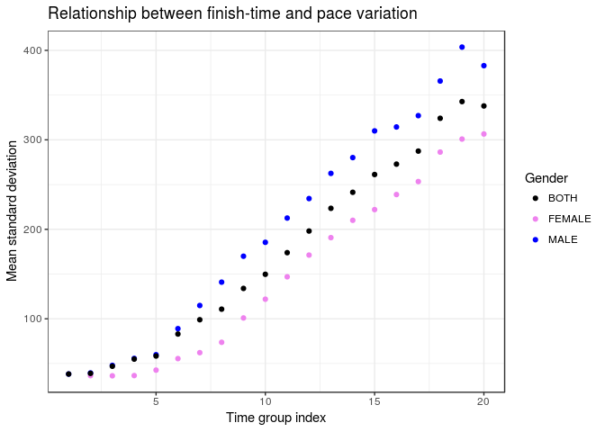

2017 Boston Marathon Analysis
================
Eduardo Faccin Vernier
December 2017

Introduction
============

Legend says that after the military victory against the Persians at the Battle of Marathon (490 BC), Greek soldier Pheidippides ran the 42.195 kilometres that separate Marathon and Athens to report the victory. What people seem to forget about this fable is that Pheidippides died *immediately* after delivering the message. And so long-distance running as we know was born...

This work analyses the 2017 Boston Marathon that took place on April 17th. Using data collected from 26,400 athletes, we will try to identify relationships between gender, age, ability, finishing times and consistency. We are going to use visualizations and statistics to support our claims.


Dataset
=======

The dataset used for this study is available at <https://www.kaggle.com/rojour/boston-results> .

It consists of 26400 observations (athletes), each of which containing name, age, gender, country, city and state (where available), times at 9 different stages of the race, finish time and pace, overall place, gender place and division place.

Given the focus of our analysis, we'll keep only information about the times, sex and gender of each athlete. The dataset is ordered by finishing time. Below can have a glimpse of the data of the first few runners to cross the line.

``` r
# Import libraries
library(dplyr);
library(magrittr);
library(ggplot2);
library(lubridate);
library(readr);
```

``` r
df <- read.csv("./marathon_results_2017.csv", header=TRUE, stringsAsFactors=FALSE)
# Select only column
df <- df[c('Age', 'M.F', 'X5K', 'X10K', 'X15K', 'X20K', 'X25K', 'X30K', 'X35K', 'X40K', 'Official.Time')]

# Filter runners that had technical problems with recording apparatus
df %<>% filter(X5K != '-' & X10K != '-' & X15K != '-' & X20K != '-' & X25K != '-' & X30K != '-' & X35K != '-' & X40K != '-')
head(df)
```

    ##   Age M.F     X5K    X10K    X15K    X20K    X25K    X30K    X35K    X40K
    ## 1  24   M 0:15:25 0:30:28 0:45:44 1:01:15 1:16:59 1:33:01 1:48:19 2:02:53
    ## 2  30   M 0:15:24 0:30:27 0:45:44 1:01:15 1:16:59 1:33:01 1:48:19 2:03:14
    ## 3  25   M 0:15:25 0:30:29 0:45:44 1:01:16 1:17:00 1:33:01 1:48:31 2:03:38
    ## 4  32   M 0:15:25 0:30:29 0:45:44 1:01:19 1:17:00 1:33:01 1:48:58 2:04:35
    ## 5  31   M 0:15:25 0:30:28 0:45:44 1:01:15 1:16:59 1:33:01 1:48:41 2:05:00
    ## 6  40   M 0:15:25 0:30:28 0:45:44 1:01:15 1:16:59 1:33:01 1:48:52 2:05:21
    ##   Official.Time
    ## 1       2:09:37
    ## 2       2:09:58
    ## 3       2:10:28
    ## 4       2:12:08
    ## 5       2:12:35
    ## 6       2:12:45

``` r
print(paste("Number of runners: ", nrow(df)))
```

    ## [1] "Number of runners:  26262"

``` r
print(paste("Number faulty observations: ", 26400 - nrow(df)))
```

    ## [1] "Number faulty observations:  138"

As we can see, there are 8 columns that show the surpassed time at each 5K mark. Later we'll do some pace variance analysis, so we'll convert these times to be the time passed **not** from the start of the race, but from the mark of the previous 5K split.

This means that, for example, the X15K column will not tell how long it took the runner to run 15 kilometres, but how long it took the runner to run the last 5 kilomentres preceding the 15K mark, i.e., from 10K to 15K.

``` r
cols <- c('X5K', 'X10K', 'X15K', 'X20K', 'X25K', 'X30K', 'X35K', 'X40K')
df %<>% mutate_each_(funs(as.POSIXct(., format="%H:%M:%S")), cols);

df$X40K <- as.numeric(difftime(df$X40K, df$X35K, units='secs'))
df$X35K <- as.numeric(difftime(df$X35K, df$X30K, units='secs'))
df$X30K <- as.numeric(difftime(df$X30K, df$X25K, units='secs'))
df$X25K <- as.numeric(difftime(df$X25K, df$X20K, units='secs'))
df$X20K <- as.numeric(difftime(df$X20K, df$X15K, units='secs'))
df$X15K <- as.numeric(difftime(df$X15K, df$X10K, units='secs'))
df$X10K <- as.numeric(difftime(df$X10K, df$X5K, units='secs'))
df$X5K <- as.numeric(difftime(df$X5K, as.POSIXct('00:00:00', format="%H:%M:%S"), units='secs'))
colnames(df)[colnames(df) == 'M.F'] <- 'Gender'
head(df)
```

Now we can read the data frame above as: it took 925 seconds for runner \#1 to run the first 5K of the race, 903s to run the next 5K, and so on.

But before we move to the analysis of the results, let's take a look at the demographics of the population.

Inside a marathon there are many simultaneous events. There are men and women's division, as well as 10 official divisons by age intervals. The main age group is the \[18, 39\] year old, after that there are 9 age groups, but for sake of conciseness, we'll divide athletes into 2 groups: young (belonging to the \[18, 39\] age bracket), and 40+, for the remaining.

``` r
demo <- df %>%
  mutate(Gender, Gender = ifelse('M' == Gender,'MEN', 'WOMEN')) %>% 
  mutate(Age, Age = ifelse(Age >= 40, '40+', 'YOUNG')) %>% 
  group_by(Gender, Age) %>% 
  count()

demo$comb <- paste(demo$Age, demo$Gender)

# Pie Chart with Percentages
slices <- demo$n
lbls <- demo$comb
pct <- round(slices/sum(slices)*100)
lbls <- paste(lbls, pct) # add percents to labels 
lbls <- paste(lbls,"%",sep="") # ad % to labels 
pie(slices, labels = lbls, col=c("blue", "cyan", "violet", "pink"), main="Distribution of gender and age")
```


Given the pie chart above, we can see that our population composed of 55% men and 45% women.

As for age, 44% of people are in the "young" range, whilst the remaining are 40 years or older.

The largest group is 40+ men and the smallest is young men, which is interesting.

How gender and age influence finish-times
=========================================

The graph below shows compares finishing times between men and women. Because the number of male and female runners differ, the histograms have been normalized.

The plot tells us that men tend to be faster than women. This is not unexpected, as there are physiological reasons why men are capable of faster finish-times than women.

``` r
df$Official.Time <- as.POSIXct(df$Official.Time, format="%H:%M:%S")
ggplot(df, aes(df$Official.Time, fill = df$Gender)) +
  geom_histogram(aes(y=..density..), alpha=0.5, 
                 position="identity", lwd=0.2) +
  ggtitle("Normalized finish-times for men vs. women")
```

    ## `stat_bin()` using `bins = 30`. Pick better value with `binwidth`.


``` r
df %>%
  mutate(Age, Age = ifelse(Age > 40, '40+', 'YOUNG')) %>% 
  ggplot(aes(Official.Time, fill = Age)) +
    geom_histogram(aes(y=..density..), alpha=0.5, 
                 position="identity", lwd=0.2) +
  ggtitle("Normalized finish-times for young vs. 40+")
```

    ## `stat_bin()` using `bins = 30`. Pick better value with `binwidth`.


``` r
n_groups <- 20
zebra_colormap <- rep(c("darkcyan", "cyan"), 20)

df <- df[df$Official.Time < quantile(df$Official.Time, 0.99), ]


#splits = split(df, cut(df$Official.Time, N))  # Time splits
#splits <- split(df, rep(1:ceiling(nrow(df)/N), each=N, length.out=nrow(df)))  # N marathoners splits
#df$group <- rep(1:ceiling(nrow(df)/n_groups), each=nrow(df)/n_groups, length.out=nrow(df))  # N marathoners splits
df$Official.Time <- as.numeric(difftime(df$Official.Time, as.POSIXct('00:00:00', format="%H:%M:%S"), units='mins'))
df$group <- cut(df$Official.Time, n_groups)

ggplot(df) + 
  geom_point(aes(x=1:NROW(df), y=df$Official.Time,  col=as.factor(df$group))) +
  scale_color_manual(values=zebra_colormap) +
  theme_bw()
```


Are women more disciplined than men?

``` r
women <- df %>%
  filter(Gender == 'F')

men <- df %>%
  filter(Gender == 'M')

b_splits = split(df, df$group)  # Time splits
w_splits = split(women, women$group)  # Time splits
m_splits = split(men, men$group)  # Time splits


g_sd_df <- data.frame("group" = numeric(0),
                      "gender" = character(0),
                      "n" = numeric(0),
                      "mean_sd" = numeric(0),
                      "sd_sd" = numeric(0),
                      stringsAsFactors = FALSE)

for (i in 1:n_groups) {
  gender <- 'M'
  mean_sd <- as.numeric(m_splits[[i]] %>%
                    select(cols) %>%
                    transform(SD=apply(., 1, sd, na.rm = TRUE)) %>%
                    summarize(sample_sd = mean(SD, na.rm = TRUE)))
  sd_sd <- as.numeric(m_splits[[i]] %>%
                    select(cols) %>%
                    transform(SD=apply(., 1, sd, na.rm = TRUE)) %>%
                    summarize(sd_sd = sd(SD, na.rm = TRUE)))
  n <- as.numeric(m_splits[[i]] %>%
                    select(Official.Time) %>%
                    summarize(n = n()))
  g_sd_df[nrow(g_sd_df) + 1,] = c(i, gender, n, mean_sd, sd_sd)
  
  
  gender <- 'F'
  mean_sd <- as.numeric(w_splits[[i]] %>%
                    select(cols) %>%
                    transform(SD=apply(., 1, sd, na.rm = TRUE)) %>%
                    summarize(sample_sd = mean(SD, na.rm = TRUE)))
  sd_sd <- as.numeric(w_splits[[i]] %>%
                    select(cols) %>%
                    transform(SD=apply(., 1, sd, na.rm = TRUE)) %>%
                    summarize(sd_sd = sd(SD, na.rm = TRUE)))
  n <- as.numeric(w_splits[[i]] %>%
                    select(Official.Time) %>%
                    summarize(n = n()))
  if (n != 0) {
    g_sd_df[nrow(g_sd_df) + 1,] = c(i, gender, n, mean_sd, sd_sd)
  }

  gender <- 'B'
  mean_sd <- as.numeric(b_splits[[i]] %>%
                    select(cols) %>%
                    transform(SD=apply(., 1, sd, na.rm = TRUE)) %>%
                    summarize(sample_sd = mean(SD, na.rm = TRUE)))
  sd_sd <- as.numeric(b_splits[[i]] %>%
                    select(cols) %>%
                    transform(SD=apply(., 1, sd, na.rm = TRUE)) %>%
                    summarize(sd_sd = sd(SD, na.rm = TRUE)))
  n <- as.numeric(b_splits[[i]] %>%
                    select(Official.Time) %>%
                    summarize(n = n()))
  g_sd_df[nrow(g_sd_df) + 1,] = c(i, gender, n, mean_sd, sd_sd)
  
}


g_sd_df$n <- as.numeric(g_sd_df$n)
g_sd_df$mean_sd <- as.numeric(g_sd_df$mean_sd)
g_sd_df$sd_sd <- as.numeric(g_sd_df$sd_sd)
g_sd_df$group <- as.numeric(g_sd_df$group)
g_sd_df
```

    ##    group gender    n   mean_sd     sd_sd
    ## 1      1      M   20  38.27507  19.92175
    ## 2      1      B   20  38.27507  19.92175
    ## 3      2      M   43  39.46135  29.95823
    ## 4      2      F    8  36.43171  18.58525
    ## 5      2      B   51  38.98611  28.34594
    ## 6      3      M  174  47.93407  33.78129
    ## 7      3      F   16  36.29235  24.29730
    ## 8      3      B  190  46.95372  33.19532
    ## 9      4      M  572  55.72010  42.95869
    ## 10     4      F   24  36.52757  19.61190
    ## 11     4      B  596  54.94725  42.42804
    ## 12     5      M 1138  59.84978  44.26759
    ## 13     5      F  105  42.63999  26.56413
    ## 14     5      B 1243  58.39602  43.31239
    ## 15     6      M 1545  88.98942  55.16976
    ## 16     6      F  337  55.49481  31.18230
    ## 17     6      B 1882  82.99171  53.26430
    ## 18     7      M 1742 114.85999  70.37731
    ## 19     7      F  753  62.15704  41.01972
    ## 20     7      B 2495  98.95405  67.45679
    ## 21     8      M 1654 140.95475  84.06847
    ## 22     8      F 1348  73.73308  41.29138
    ## 23     8      B 3002 110.76994  76.00331
    ## 24     9      M 1574 169.92828  99.16815
    ## 25     9      F 1717 100.93465  54.53018
    ## 26     9      B 3291 133.93252  86.26139
    ## 27    10      M 1363 185.47146 108.04135
    ## 28    10      F 1750 121.90053  66.16859
    ## 29    10      B 3113 149.73451  92.54447
    ## 30    11      M  925 212.57744 122.19973
    ## 31    11      F 1325 146.91404  77.19533
    ## 32    11      B 2250 173.90899 103.38088
    ## 33    12      M  813 234.36426 134.95519
    ## 34    12      F 1097 171.19461  86.19351
    ## 35    12      B 1910 198.08305 113.96632
    ## 36    13      M  673 262.51198 150.15485
    ## 37    13      F  802 190.69926 113.34592
    ## 38    13      B 1475 223.46534 136.16436
    ## 39    14      M  519 280.14990 181.11344
    ## 40    14      F  643 210.07861 129.45303
    ## 41    14      B 1162 241.37551 158.48191
    ## 42    15      M  415 309.99857 189.94179
    ## 43    15      F  516 222.02667 125.29180
    ## 44    15      B  931 261.24078 163.30194
    ## 45    16      M  325 314.38013 186.03662
    ## 46    16      F  397 238.85977 178.66379
    ## 47    16      B  722 272.85439 185.73746
    ## 48    17      M  267 327.03602 165.03295
    ## 49    17      F  311 253.37339 139.24620
    ## 50    17      B  578 287.40094 155.96198
    ## 51    18      M  223 365.73323 209.58219
    ## 52    18      F  246 286.32150 165.47138
    ## 53    18      B  469 324.08017 191.69286
    ## 54    19      M  141 403.64226 321.92175
    ## 55    19      F  205 300.87035 199.73412
    ## 56    19      B  346 342.75139 261.15343
    ## 57    20      M  112 382.90041 181.30418
    ## 58    20      F  161 306.52079 217.83997
    ## 59    20      B  273 337.85602 206.74933

``` r
ggplot(g_sd_df) +
  geom_point(aes(x=group, y=mean_sd, colour=gender)) +
  scale_color_manual(values=c('black', 'violet', 'blue')) +
  theme_bw()
```



<https://www.youtube.com/watch?v=d7nLL6cUC0I>

``` r
g_sd_df <- filter(g_sd_df, g_sd_df$gender == 'M' | g_sd_df$gender == 'F')
g_sd_df$min_error <- ((g_sd_df$n-1) * (g_sd_df$mean_sd * g_sd_df$mean_sd)) / qchisq(.025, df = g_sd_df$n - 1, lower.tail = FALSE)
g_sd_df$max_error <- ((g_sd_df$n-1) * (g_sd_df$mean_sd * g_sd_df$mean_sd)) / qchisq(.975, df = g_sd_df$n - 1, lower.tail = FALSE)
g_sd_df
```

    ##    group gender    n   mean_sd     sd_sd   min_error  max_error
    ## 1      1      M   20  38.27507  19.92175    847.2654   3125.199
    ## 2      2      M   43  39.46135  29.95823   1058.6881   2515.603
    ## 3      2      F    8  36.43171  18.58525    580.2174   5497.991
    ## 4      3      M  174  47.93407  33.78129   1881.0831   2870.597
    ## 5      3      F   16  36.29235  24.29730    718.7404   3154.996
    ## 6      4      M  572  55.72010  42.95869   2773.8690   3498.855
    ## 7      4      F   24  36.52757  19.61190    805.9763   2625.480
    ## 8      5      M 1138  59.84978  44.26759   3304.8660   3895.691
    ## 9      5      F  105  42.63999  26.56413   1409.9462   2434.456
    ## 10     6      M 1545  88.98942  55.16976   7388.8936   8508.828
    ## 11     6      F  337  55.49481  31.18230   2662.3021   3604.066
    ## 12     7      M 1742 114.85999  70.37731  12358.4826  14115.027
    ## 13     7      F  753  62.15704  41.01972   3500.9013   4285.801
    ## 14     8      M 1654 140.95475  84.06847  18580.3653  21295.513
    ## 15     8      F 1348  73.73308  41.29138   5048.2582   5871.701
    ## 16     9      M 1574 169.92828  99.16815  26959.2569  31004.896
    ## 17     9      F 1717 100.93465  54.53018   9539.0619  10905.395
    ## 18    10      M 1363 185.47146 108.04135  31955.4829  37136.857
    ## 19    10      F 1750 121.90053  66.16859  13922.0327  15895.969
    ## 20    11      M  925 212.57744 122.19973  41335.9049  49610.377
    ## 21    11      F 1325 146.91404  77.19533  20029.5126  23327.098
    ## 22    12      M  813 234.36426 134.95519  49952.2214  60686.876
    ## 23    12      F 1097 171.19461  86.19351  27000.6523  31924.927
    ## 24    13      M  673 262.51198 150.15485  62099.3021  76918.063
    ## 25    13      F  802 190.69926 113.34592  33051.7745  40208.139
    ## 26    14      M  519 280.14990 181.11344  69738.6719  88993.078
    ## 27    14      F  643 210.07861 129.45303  39676.7446  49388.706
    ## 28    15      M  415 309.99857 189.94179  84242.5460 110661.660
    ## 29    15      F  516 222.02667 125.29180  43788.3176  55917.706
    ## 30    16      M  325 314.38013 186.03662  85220.8354 116011.807
    ## 31    16      F  397 238.85977 178.66379  49871.9874  65916.083
    ## 32    17      M  267 327.03602 165.03295  90872.1768 127738.242
    ## 33    17      F  311 253.37339 139.24620  55179.2021  75636.709
    ## 34    18      M  223 365.73323 209.58219 111988.8121 162598.919
    ## 35    18      F  246 286.32150 165.47138  69199.8309  98679.582
    ## 36    19      M  141 403.64226 321.92175 130604.4890 209001.699
    ## 37    19      F  205 300.87035 199.73412  75236.5537 111019.293
    ## 38    20      M  112 382.90041 181.30418 114566.4766 194351.314
    ## 39    20      F  161 306.52079 217.83997  76341.5100 118489.741

``` r
ggplot(g_sd_df, aes(x=group, y=mean_sd, colour=gender)) +
  geom_errorbar(aes(ymin=min_error, ymax=max_error)) +
  scale_color_manual(values=c('violet', 'blue')) +
  theme_bw()
```


``` r
corr <- df %>%
  select(cols) %>%
  transform(SD=apply(., 1, sd, na.rm = TRUE)) %>%
  select(c('SD')) %>%
  as.data.frame()

corr <- bind_cols(corr, select(df, c('Official.Time')))

ggplot(corr, aes(x=Official.Time, y=SD)) +
  #stat_density_2d(geom = "raster", aes(fill = ..density..), contour = FALSE)
  #stat_density_2d(aes(fill = ..level..), geom = "polygon")
  #stat_density_2d(geom = "point", aes(size = ..density..), n = 20, contour = FALSE)
  geom_hex(binwidth = c(1, 20)) + 
  theme_bw()
```


``` r
if (!file.exists('animation.gif')) {
  library(animation)

  n_samples <- 20
  sample <- df %>%
    group_by(group) %>%
    sample_n(n_samples, replace=TRUE)
  
  times <- t(data.matrix(select(sample, cols)))
  
  makeplot <- function() {
    for(i in 1:nrow(sample)) {
    
      plot.ts(times[cols,1:i], 
              plot.type="single", 
              lwd=0.5, 
              col=rep(rainbow(n_groups), each=n_samples), 
              ylim=c(900, 3000), 
              xlab='', ylab='', axes = F)
      
      lines(times[cols,i], 
            lwd=2, col=1, 
            xlab='', ylab='', axes = F)
      
      title(main="5K pace analysis", sub=paste('Group rank #', as.character(ceiling(i/n_samples))), xlab="", ylab="Split time (seconds)")
      axis(side=2,at=c(800, 1000, 1500, 2000, 2500, 3000),labels=c('800', '1000', '1500', '2000', '2500', '3000'))
      axis(side=1,at=c(-10,1,2,3,4,5,6,7,8),labels=c('','5K', '10K', '15K', '20K', '25K', '30K', '35K', '40K'))
    }
  }
  oopt = ani.options(interval = 0, nmax = n_runners)
  saveGIF(makeplot(),interval = 0.1, width = 580, height = 400)
  ani.options(oopt)
}
```


