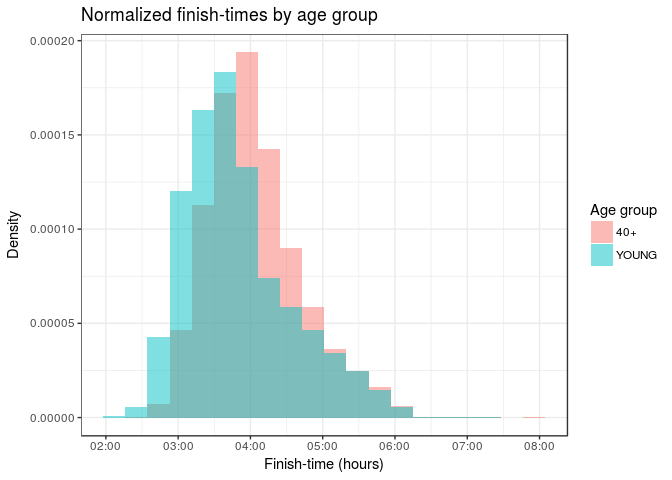
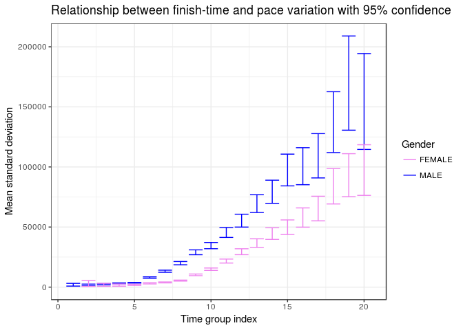

2017 Boston Marathon Analysis
================
Eduardo Faccin Vernier
December 2017

Introduction
------------

Legend says that after the military victory against the Persians at the Battle of Marathon (490 BC), Greek soldier Pheidippides ran the 42.195 kilometres that separate Marathon and Athens to report the victory. What people seem to forget about this fable is that Pheidippides died *immediately* after delivering the message. And so long-distance running as we know was born...

This work analyses the 2017 Boston Marathon that took place on April 17th. Using data collected from 26,262 athletes, we will try to identify relationships between gender, age, ability, finishing times and consistency. We are going to use visualizations and statistics to support our claims.


Dataset
-------

The dataset used for this study is available at <https://www.kaggle.com/rojour/boston-results> .

It consists of 26400 observations (athletes), each of which containing name, age, gender, country, city and state (where available), times at 9 different stages of the race, finish time and pace, overall place, gender place and division place.

Given the focus of our analysis, we'll keep only information about the times, sex and gender of each athlete. Some observations have missing time data, we will filter those out for simplicity. The dataset is ordered by finishing time. Below we can have a glimpse of the data of the first few runners to cross the line.

``` r
# Import libraries
library(dplyr);
library(magrittr);
library(ggplot2);
library(lubridate);
library(readr);
```

``` r
df <- read.csv("./marathon_results_2017.csv", header=TRUE, stringsAsFactors=FALSE)
all_n <- nrow(df)
# Select only columns of interest
df <- df[c('Age', 'M.F', 'X5K', 'X10K', 'X15K', 'X20K', 'X25K', 'X30K', 'X35K', 'X40K', 'Official.Time')]

# Filter runners that had technical problems with recording apparatus
df %<>% filter(X5K != '-' & X10K != '-' & X15K != '-' & X20K != '-' & X25K != '-' & X30K != '-' & X35K != '-' & X40K != '-')
colnames(df)[colnames(df) == 'M.F'] <- 'Gender'

head(df)
```

    ##   Age Gender     X5K    X10K    X15K    X20K    X25K    X30K    X35K
    ## 1  24      M 0:15:25 0:30:28 0:45:44 1:01:15 1:16:59 1:33:01 1:48:19
    ## 2  30      M 0:15:24 0:30:27 0:45:44 1:01:15 1:16:59 1:33:01 1:48:19
    ## 3  25      M 0:15:25 0:30:29 0:45:44 1:01:16 1:17:00 1:33:01 1:48:31
    ## 4  32      M 0:15:25 0:30:29 0:45:44 1:01:19 1:17:00 1:33:01 1:48:58
    ## 5  31      M 0:15:25 0:30:28 0:45:44 1:01:15 1:16:59 1:33:01 1:48:41
    ## 6  40      M 0:15:25 0:30:28 0:45:44 1:01:15 1:16:59 1:33:01 1:48:52
    ##      X40K Official.Time
    ## 1 2:02:53       2:09:37
    ## 2 2:03:14       2:09:58
    ## 3 2:03:38       2:10:28
    ## 4 2:04:35       2:12:08
    ## 5 2:05:00       2:12:35
    ## 6 2:05:21       2:12:45

``` r
print(paste("Number of runners: ", nrow(df)))
```

    ## [1] "Number of runners:  26262"

``` r
print(paste("Number faulty observations: ", all_n - nrow(df)))
```

    ## [1] "Number faulty observations:  148"

As we can see, there are 8 columns that show the surpassed time at each 5K mark. Later we'll do some pace variance analysis, so we'll convert these times to be the time passed from the mark of the previous 5K split, and **not** from the start of the race.

This means that, for example, the X15K column will not tell how long it took the runner to run 15 kilometers, but how long it took the runner to run the last 5 kilometers preceding the 15K mark, i.e., from 10K to 15K.

``` r
cols <- c('X5K', 'X10K', 'X15K', 'X20K', 'X25K', 'X30K', 'X35K', 'X40K')
df %<>% mutate_each_(funs(as.POSIXct(., format="%H:%M:%S")), cols);

df$X40K <- as.numeric(difftime(df$X40K, df$X35K, units='secs'))
df$X35K <- as.numeric(difftime(df$X35K, df$X30K, units='secs'))
df$X30K <- as.numeric(difftime(df$X30K, df$X25K, units='secs'))
df$X25K <- as.numeric(difftime(df$X25K, df$X20K, units='secs'))
df$X20K <- as.numeric(difftime(df$X20K, df$X15K, units='secs'))
df$X15K <- as.numeric(difftime(df$X15K, df$X10K, units='secs'))
df$X10K <- as.numeric(difftime(df$X10K, df$X5K, units='secs'))
df$X5K <- as.numeric(difftime(df$X5K, as.POSIXct('00:00:00', format="%H:%M:%S"), units='secs'))
```

Before we move to the analysis of the results, let's take a look at the demographics of the population.

Inside a marathon there are many simultaneous events. There are men and women's division, as well as 10 official divisons by age intervals. The main age group is the \[18, 39\] year old, after that there are 9 age groups each with 5 a year span, but for sake of conciseness, we'll divide athletes into 2 groups: young (belonging to the \[18, 39\] age bracket), and 40+, for the remaining.

``` r
demo <- df %>%
  mutate(Gender, Gender = ifelse('M' == Gender,'MEN', 'WOMEN')) %>% 
  mutate(Age, Age = ifelse(Age >= 40, '40+', 'YOUNG')) %>% 
  group_by(Gender, Age) %>% 
  count()

demo$comb <- paste(demo$Age, demo$Gender)

# Pie Chart with Percentages
slices <- demo$n
lbls <- demo$comb
pct <- round(slices/sum(slices)*100)
lbls <- paste(lbls, pct) # add percents to labels 
lbls <- paste(lbls,"%",sep="") # ad % to labels 
pie(slices, labels = lbls, col=c("#0061ff", "#76c3f7", "#f372ff", "#fcc7f8"), main="Distribution of gender and age")
```


Given the pie chart above, we can see that our population composed of 55% men and 45% women.

As for age, 44% of people are in the "young" range, whilst the remaining are 40 years or older.

The largest group is 40+ men and the smallest is young men.

How gender and age influence finish-times
-----------------------------------------

The graph below shows compares finishing times between men and women. Because the number of male and female runners differ, the histograms have been normalized.

The plot tells us that men tend to be faster than women. This is not unexpected, as there are physiological reasons why men are capable of faster finish-times than women.

``` r
df$Official.Time <- as.POSIXct(df$Official.Time, format="%H:%M:%S")
ggplot(df, aes(df$Official.Time, fill = df$Gender)) +
  geom_histogram(bins = 20, aes(y=..density..), alpha=0.5, position="identity", lwd=0.2) +
  labs(title = "Normalized finish-times for men vs. women", x = "Finish-time (hours)", y = "Density") +
  scale_fill_discrete(name="Gender") + 
  theme_bw()
```


The next graph shows finishing times for the two age groups we defined.

We can see that among fast finishing times (let's say below 4 hours), the number of young runners is proportionally higher than that of older runners.

But that doesn't seem to be the case for the slower runners, as we can see that after the 5:00 hour mark, the area under the histogram seems to be equivalent for both age groups.

In other words: yes, the fastest young runners are faster than the fastest old runners, but that is not true for the slower athletes. That is, age doesn't seem to be of much importance for the least skilled runners.

``` r
df %>%
  mutate(Age, Age = ifelse(Age > 40, '40+', 'YOUNG')) %>% 
  ggplot(aes(Official.Time, fill = Age)) +
    geom_histogram(bins = 20, aes(y=..density..), alpha=0.5, position="identity", lwd=0.2) +
    labs(title = "Normalized finish-times by age group", x = "Finish-time (hours)", y = "Density") +
    scale_fill_discrete(name="Age group") + 
    theme_bw()
```



How finish-time, gender and age influence pace consistency
----------------------------------------------------------

Finish-time is one metric for running performance, but it is not the only one. Pace variation is often seen as an indicator of ability and, generally speaking, less variation in pace is considered to be a sign of a more disciplined and able runner.

We would to see if these two measurements are correlated. That is, are fast runners really more disciplined?

To find out we compute the standard deviation between the 8 5K splits for each runner, and then group them into 20 evenly spaced time-intervals. The first runners to finish the race are in group 1 and last are in group 20 (note that the grouping is not done by finishing position, but finishing-time). Then for each group we compute the mean standard deviation. The plot below show how finish group relates to pace variation.

``` r
n_groups <- 20
df$Official.Time <- as.numeric(difftime(df$Official.Time, as.POSIXct('00:00:00', format="%H:%M:%S"), units='mins'))
df <- df[df$Official.Time < quantile(df$Official.Time, 0.99), ]
df$group <- cut(df$Official.Time, n_groups)

women <- df %>% filter(Gender == 'F')
men <- df %>% filter(Gender == 'M')

b_splits = split(df, df$group)  # Time splits
w_splits = split(women, women$group)  
m_splits = split(men, men$group)  

g_sd_df <- data.frame("group" = numeric(0),
                      "Gender" = character(0),
                      "n" = numeric(0),
                      "mean_sd" = numeric(0),
                      "sd_sd" = numeric(0),
                      stringsAsFactors = FALSE)

for (i in 1:n_groups) {
  gender <- 'MALE'
  mean_sd <- as.numeric(m_splits[[i]] %>%
                    select(cols) %>%
                    transform(SD=apply(., 1, sd, na.rm = TRUE)) %>%
                    summarize(sample_sd = mean(SD, na.rm = TRUE)))
  sd_sd <- as.numeric(m_splits[[i]] %>%
                    select(cols) %>%
                    transform(SD=apply(., 1, sd, na.rm = TRUE)) %>%
                    summarize(sd_sd = sd(SD, na.rm = TRUE)))
  n <- as.numeric(m_splits[[i]] %>%
                    select(Official.Time) %>%
                    summarize(n = n()))
  g_sd_df[nrow(g_sd_df) + 1,] = c(i, gender, n, mean_sd, sd_sd)
  
  gender <- 'FEMALE'
  mean_sd <- as.numeric(w_splits[[i]] %>%
                    select(cols) %>%
                    transform(SD=apply(., 1, sd, na.rm = TRUE)) %>%
                    summarize(sample_sd = mean(SD, na.rm = TRUE)))
  sd_sd <- as.numeric(w_splits[[i]] %>%
                    select(cols) %>%
                    transform(SD=apply(., 1, sd, na.rm = TRUE)) %>%
                    summarize(sd_sd = sd(SD, na.rm = TRUE)))
  n <- as.numeric(w_splits[[i]] %>%
                    select(Official.Time) %>%
                    summarize(n = n()))
  if (n != 0) {
    g_sd_df[nrow(g_sd_df) + 1,] = c(i, gender, n, mean_sd, sd_sd)
  }

  gender <- 'BOTH'
  mean_sd <- as.numeric(b_splits[[i]] %>%
                    select(cols) %>%
                    transform(SD=apply(., 1, sd, na.rm = TRUE)) %>%
                    summarize(sample_sd = mean(SD, na.rm = TRUE)))
  sd_sd <- as.numeric(b_splits[[i]] %>%
                    select(cols) %>%
                    transform(SD=apply(., 1, sd, na.rm = TRUE)) %>%
                    summarize(sd_sd = sd(SD, na.rm = TRUE)))
  n <- as.numeric(b_splits[[i]] %>%
                    select(Official.Time) %>%
                    summarize(n = n()))
  g_sd_df[nrow(g_sd_df) + 1,] = c(i, gender, n, mean_sd, sd_sd)
  
}

g_sd_df$n <- as.numeric(g_sd_df$n)
g_sd_df$mean_sd <- as.numeric(g_sd_df$mean_sd)
g_sd_df$sd_sd <- as.numeric(g_sd_df$sd_sd)
g_sd_df$group <- as.numeric(g_sd_df$group)
```

``` r
intervals = unique(df$group)
for (i in 1:length(intervals)) print(paste("Group ", i,  ' - Finished race in the', intervals[i], 'minutes interval.'))
```

    ## [1] "Group  1  - Finished race in the (129,141] minutes interval."
    ## [1] "Group  2  - Finished race in the (141,152] minutes interval."
    ## [1] "Group  3  - Finished race in the (152,163] minutes interval."
    ## [1] "Group  4  - Finished race in the (163,174] minutes interval."
    ## [1] "Group  5  - Finished race in the (174,186] minutes interval."
    ## [1] "Group  6  - Finished race in the (186,197] minutes interval."
    ## [1] "Group  7  - Finished race in the (197,208] minutes interval."
    ## [1] "Group  8  - Finished race in the (208,219] minutes interval."
    ## [1] "Group  9  - Finished race in the (219,230] minutes interval."
    ## [1] "Group  10  - Finished race in the (230,242] minutes interval."
    ## [1] "Group  11  - Finished race in the (242,253] minutes interval."
    ## [1] "Group  12  - Finished race in the (253,264] minutes interval."
    ## [1] "Group  13  - Finished race in the (264,275] minutes interval."
    ## [1] "Group  14  - Finished race in the (275,286] minutes interval."
    ## [1] "Group  15  - Finished race in the (286,298] minutes interval."
    ## [1] "Group  16  - Finished race in the (298,309] minutes interval."
    ## [1] "Group  17  - Finished race in the (309,320] minutes interval."
    ## [1] "Group  18  - Finished race in the (320,331] minutes interval."
    ## [1] "Group  19  - Finished race in the (331,342] minutes interval."
    ## [1] "Group  20  - Finished race in the (342,354] minutes interval."

Based on the plot below we can make two claims:

1 - Fast runners' paces vary less than slow runners.

2 - Men tend to be less disciplined than women with similar finishing-time.

``` r
ggplot(g_sd_df) +
  geom_point(aes(x=group, y=mean_sd, colour=Gender)) +
  scale_color_manual(values=c('black', 'violet', 'blue')) +
  theme_bw() +
  labs(title = "Relationship between finish-time and pace variation", x = "Time group index", y = "Mean standard deviation")
```


The graph above is very enlightening but it doesn't take into consideration that some groups have a small number of runners, introducing a level of uncertainty to the statistics.

Fortunately, there are ways we can account for that. If want to find out the population standard deviation and we are given a sample standard deviation and sample size, assuming that our population data is normally distributed, we can use a chi-square distribution to generate a confidence interval. For the plot below we extracted a 95% confidence interval.

For more info on the statistics see:

<http://www.milefoot.com/math/stat/ci-variances.htm>

<https://www.youtube.com/watch?v=d7nLL6cUC0I>

``` r
g_sd_df <- filter(g_sd_df, g_sd_df$Gender == 'MALE' | g_sd_df$Gender == 'FEMALE')
g_sd_df$min_error <- ((g_sd_df$n-1) * (g_sd_df$mean_sd * g_sd_df$mean_sd)) / qchisq(.025, df = g_sd_df$n - 1, lower.tail = FALSE)
g_sd_df$max_error <- ((g_sd_df$n-1) * (g_sd_df$mean_sd * g_sd_df$mean_sd)) / qchisq(.975, df = g_sd_df$n - 1, lower.tail = FALSE)

ggplot(g_sd_df, aes(x=group, y=mean_sd, colour=Gender)) +
  geom_errorbar(aes(ymin=min_error, ymax=max_error)) +
  scale_color_manual(values=c('violet', 'blue')) +
  theme_bw() +
  labs(title = "Relationship between finish-time and pace variation with 95% confidence", x = "Time group index", y = "Mean standard deviation")
```



``` r
a_splits = split(df, df$Age)  # Time splits

a_sd_df <- data.frame("age" = character(0),
                      "n" = numeric(0),
                      "mean_sd" = numeric(0),
                      "sd_sd" = numeric(0),
                      stringsAsFactors = FALSE)

for (i in 1:length(a_splits)) {
   age <- a_splits[[i]]$Age[1]
   mean_sd <- as.numeric(a_splits[[i]] %>%
                    select(cols) %>%
                    transform(SD=apply(., 1, sd, na.rm = TRUE)) %>%
                    summarize(sample_sd = mean(SD, na.rm = TRUE)))
  sd_sd <- as.numeric(a_splits[[i]] %>%
                    select(cols) %>%
                    transform(SD=apply(., 1, sd, na.rm = TRUE)) %>%
                    summarize(sd_sd = sd(SD, na.rm = TRUE)))
  n <- as.numeric(a_splits[[i]] %>%
                    select(Official.Time) %>%
                    summarize(n = n()))
  a_sd_df[nrow(a_sd_df) + 1,] = c(age, n, mean_sd, sd_sd)
}
# 
# 
a_sd_df[is.na(a_sd_df)] <- 0
a_sd_df$age <- as.numeric(a_sd_df$age)
a_sd_df$n <- as.numeric(a_sd_df$n)
a_sd_df$mean_sd <- as.numeric(a_sd_df$mean_sd)
a_sd_df$sd_sd <- as.numeric(a_sd_df$sd_sd)
```

Below we see the relationship between age and pace variation. Interestingly, it resembles a parabola with global minima at ~37.

``` r
a_sd_df$min_error <- ((a_sd_df$n-1) * (a_sd_df$mean_sd * a_sd_df$mean_sd)) / qchisq(.025, df = a_sd_df$n - 1, lower.tail = FALSE)
a_sd_df$max_error <- ((a_sd_df$n-1) * (a_sd_df$mean_sd * a_sd_df$mean_sd)) / qchisq(.975, df = a_sd_df$n - 1, lower.tail = FALSE)
a_sd_df <- filter(a_sd_df,  !is.na(min_error))

ggplot(a_sd_df, aes(x=age, y=mean_sd)) +
  geom_point(aes(size = n)) +
  # Error bars were removed because some ages have very few athletes and error bars were too large
  # geom_errorbar(aes(ymin=min_error, ymax=max_error)) +
  theme_bw() + 
  labs(title = "Relationship between age and pace variation", x = "Age", y = "Mean standard deviation") + 
  scale_size_continuous(name="# runners per age")
```


Let's try a thought exercise, after all, isn't that what visualizations are about?

We can conjecture that young runners are fit, but are not wise about the limits of their bodies (maybe they are too eager and overestimate their capacity). As runners get older, they better understand their limits, but their bodies as not as capable anymore. Is the interval of 35-38 years of age the sweetspot between "wisdom" and fitness? Again, these are only (interesting) speculations.

Up until now we've always used some sort of aggretation (age, finish-group, gender) and we've never really looked at the raw data: the split values.

The next animation takes a sample of size 20 from each of the 20 finish intervals we defined earlier. Then sequentially draws the 20 draws from group 1, then the 20 draws from group 2, and so on. To help differentiate groups, each interval is colorcoded acording to the rainbow colormap. On the X axis we have the splits and on the Y axis we have how many seconds it took for the athlete to run that 5 kilometers interval.

``` r
if (!file.exists('animation.gif')) {
  library(animation)

  n_samples <- 20
  sample <- df %>%
    group_by(group) %>%
    sample_n(n_samples, replace=TRUE)
  
  times <- t(data.matrix(select(sample, cols)))
  
  makeplot <- function() {
    for(i in 1:nrow(sample)) {
    
      plot.ts(times[cols,1:i], 
              plot.type="single", 
              lwd=0.5, 
              col=rep(rainbow(n_groups), each=n_samples), 
              ylim=c(900, 3000), 
              xlab='', ylab='', axes = F)
      
      lines(times[cols,i], 
            lwd=2, col=1, 
            xlab='', ylab='', axes = F)
      
      title(main="5K pace analysis", sub=paste('Group rank #', as.character(ceiling(i/n_samples))), xlab="", ylab="Split time (seconds)")
      axis(side=2,at=c(800, 1000, 1500, 2000, 2500, 3000),labels=c('800', '1000', '1500', '2000', '2500', '3000'))
      axis(side=1,at=c(-10,1,2,3,4,5,6,7,8),labels=c('','5K', '10K', '15K', '20K', '25K', '30K', '35K', '40K'))
    }
  }
  oopt = ani.options(interval = 0, nmax = n_runners)
  saveGIF(makeplot(),interval = 0.1, width = 580, height = 400)
  ani.options(oopt)
}
```


There are many interesting conclusion we can draw from this animation:

1 - The first groups (fastest runners) generate very straight lines parallel to the X axis. They are consistently fast.

2 - As we move to slower runners, the lines get less uniform, confirming what our previous statistics told us: pace varies more for slow runners.

3 - There is something that our statistics weren't able to show us, but now we can see very clearly: Slow runners tend to start the race fast and finish it slow. We can see that by the positive slopes of the lines for the last groups.

Conclusion
----------

We've just scrachted the surface in the exploration of marathon data. Yet, with only 7 visualizations, we were able to see very interesting and strong patterns in our results.

And for every question we anwsered, many more were created. For example, are these patterns consistent for different marathons? Does nationality have a big impact on finish-time? Can we identify these same patterns in half-marathons or in ultramarathons? Do other endurance sports (cycling, swimming) show similar trends? The possibilities are endless.
